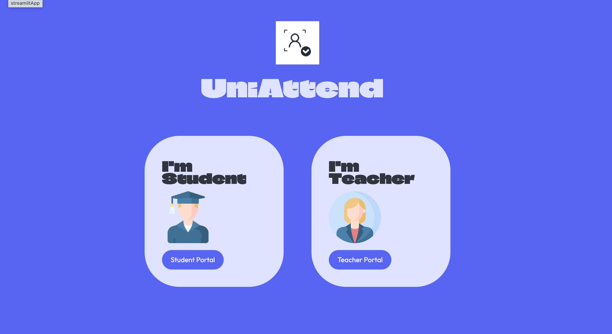

# UniAttend

AI-powered classroom attendance using face recognition, voice biometrics and QR enrollment.

Built with Streamlit and Supabase. A teacher photographs the class, the system identifies who's present, and the record syncs to the cloud — no roll call, no registers, no proxy attendance.

<p align="center">
  
</p>

---

## Why

Manual attendance eats five minutes of every lecture, is trivially faked by a friend answering roll call, and leaves paper records nobody can query later. UniAttend replaces the ritual with two biometric checks that are considerably harder to fake and a database that can be filtered in a second.

---

## Features

**Face attendance** — Upload a classroom photo. Every face is detected, converted to a 128-dimensional embedding, and matched against enrolled students by an SVM classifier.

**Voice attendance** — Students speak a short phrase one at a time; each recording is matched against their stored voiceprint.

**Review before commit** — Results appear as an editable table first. Nothing is written to the database until the teacher confirms.

**QR enrollment** — Teachers share a subject code as a QR or link. Students scan and join themselves; no roster typing.

**Face login for students** — No passwords on the student side. The camera identifies you.

**Light and dark mode** — The interface follows the operating system theme automatically.

**Live dashboards** — Per-subject attendance percentages for students, per-student present/total counts for teachers.

---

## Tech stack

| Layer | Tools |
|---|---|
| Interface | Streamlit, custom CSS |
| Face | dlib (detector, landmarks, ResNet embeddings), scikit-learn SVM |
| Voice | Resemblyzer, librosa |
| Data | Supabase (PostgreSQL) |
| Auth | bcrypt (teachers), face match (students) |
| QR | segno |

---

## How it works

1. **Detect** — dlib's frontal face detector finds faces in the image.
2. **Landmark** — 68 facial points are located per face.
3. **Embed** — each face becomes a 128-number vector; each voice sample becomes a 256-number vector.
4. **Classify** — an SVM trained on enrolled students' embeddings predicts identities.
5. **Store** — confirmed results are written to `attendance_logs` in Supabase.

The classifier is trained in memory at runtime from whatever is in the `students` table, so enrolling a new student takes effect immediately without retraining a saved model.

---

## Setup

Requires **Python 3.11** and Git.

```bash
git clone https://github.com/YOUR-USERNAME/Uni-Attend.git
cd Uni-Attend

python -m venv venv
venv\Scripts\activate          # Windows
source venv/bin/activate       # Mac / Linux

pip install -r requirements.txt
```

Create a free [Supabase](https://supabase.com) project, then run `supabase_schema.sql` in the SQL Editor to create the five tables.

Add your credentials to `.streamlit/secrets.toml`:

```toml
SUPABASE_URL = "https://your-project.supabase.co"
SUPABASE_KEY = "your-anon-public-key"
```

Run it:

```bash
streamlit run app.py
```

---

## Deployment

Deploys free on Streamlit Community Cloud. Point it at the repo, set Python to 3.11 in advanced settings, and paste the same two secrets into the secrets box. `packages.txt` installs the audio libraries librosa needs on Linux.

---

## Known limitations

Worth stating plainly, because they're real:

- **No liveness detection.** A printed photo or a phone screen held up to the camera would likely pass face attendance, and a pre-recorded clip would likely pass voice. This is the single biggest gap.
- **Lighting and angle sensitivity.** dlib's frontal detector misses faces turned in profile or heavily shadowed, so back-row students in a wide classroom shot can be silently skipped.
- **Startup latency.** The first recognition after launch takes several seconds while dlib loads its models.
- **Scaling.** The SVM is retrained from the full student table on every cold start. Fine for a few hundred students, not for a university.
- **Permissive database rules.** Row Level Security is disabled so the anon key can read and write freely. Acceptable for a demo, not for real student records.
- **Fixed matching threshold.** The voice similarity cutoff is hardcoded rather than tuned per-speaker or per-environment.

---

## Future vision

- **Anti-spoofing** — blink/motion challenges, texture analysis to separate real skin from a screen, and randomised spoken phrases so old recordings fail.
- **Stronger face model** — replace dlib's ResNet with ArcFace or FaceNet embeddings for better accuracy on angles and poor lighting.
- **Proper auth** — migrate to Supabase Auth with real Row Level Security policies per role.
- **Multi-camera capture** — stitch several angles into one session so nobody is hidden behind a row.
- **Analytics** — attendance trends, at-risk-student flags, CSV and PDF export.
- **Mobile app** — native camera and mic instead of browser capture.

---

## Credits

Built collaboratively by **Deeksha Dhatterwal** and **Mahima**.

---

If this was useful, a star on the repo is appreciated.